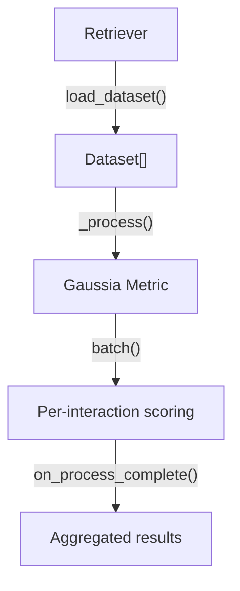
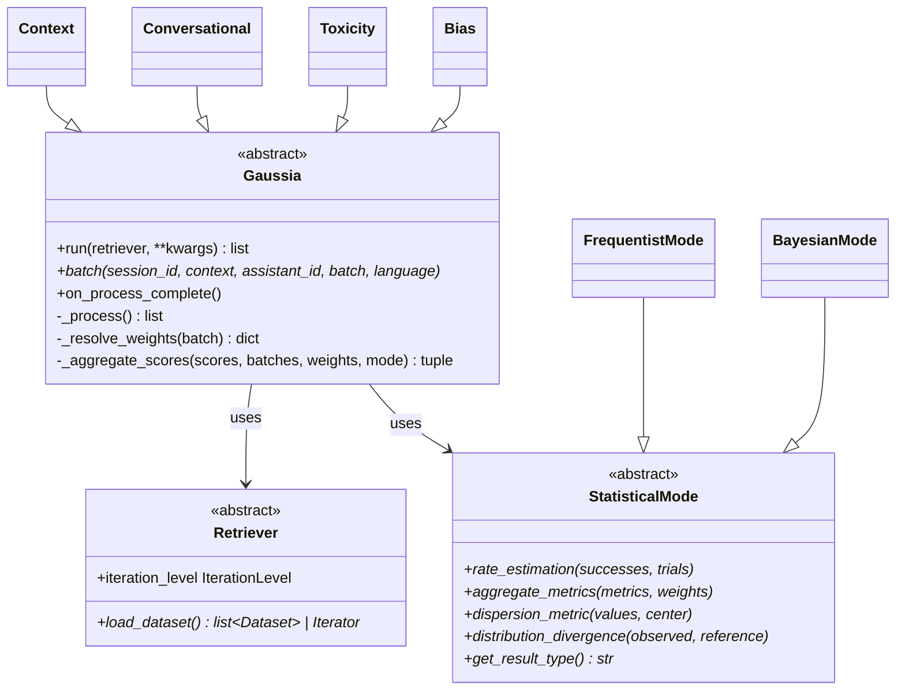

## Pipeline overview

Every Gaussia evaluation follows a single pipeline. Data flows through four stages:



### 1. Retriever

The `Retriever` is an abstract class you implement to load conversation data from any source — a database, API, CSV file, or in-memory data. It returns a list of `Dataset` objects (or an iterator for streaming).

### 2. Dataset

A `Dataset` represents a complete conversation session. It contains metadata (session ID, assistant ID, language, context) and a list of `Batch` objects — each one a single user–assistant interaction.

### 3. Metric processing

The `Gaussia` base class orchestrates iteration. It calls your metric's `batch()` method for each conversation, passing the session metadata and the list of interactions.

### 4. Aggregation

After all conversations are processed, `on_process_complete()` runs. Metrics that accumulate data across sessions (like Toxicity) use this hook to compute global results.

## Iteration levels

The pipeline supports three iteration strategies, configured via the `Retriever.iteration_level` property:

| Level | Description | Use case |
|---|---|---|
| `FULL_DATASET` | Loads everything into memory, iterates by session | Small to medium datasets |
| `STREAM_SESSIONS` | Yields one `Dataset` at a time via generator | Large datasets that don't fit in memory |
| `STREAM_BATCHES` | Yields one `StreamedBatch` at a time | Real-time or event-driven evaluation |

```python
from gaussia.schemas.common import IterationLevel

class StreamingRetriever(Retriever):
    @property
    def iteration_level(self) -> IterationLevel:
        return IterationLevel.STREAM_SESSIONS

    def load_dataset(self):
        for session in fetch_sessions():
            yield Dataset(...)
```

## Class hierarchy



## Weight resolution

Gaussia supports per-interaction weighting. When a `Batch` has a `weight` field:

- **All weights provided**: Must sum to 1.0, otherwise falls back to equal weights
- **Some weights provided**: Remaining weight is distributed equally among unweighted interactions
- **No weights**: All interactions receive equal weight (`1/n`)

This applies to all metrics that use `_aggregate_scores()`.
