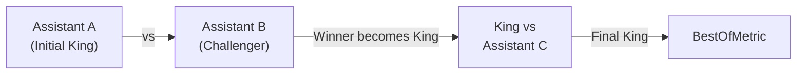

## Overview

The **BestOf** metric implements a king-of-the-hill tournament to compare multiple AI assistants. The first assistant becomes the initial King, and each subsequent assistant challenges the current King in a head-to-head LLM-judged comparison.

## How it works



- **N-1 comparisons** for N assistants (not a full bracket)
- **Order-dependent**: The first assistant starts as King and defends
- Requires **at least 2 assistants** per block

## Usage

```python
from langchain_openai import ChatOpenAI
from gaussia.metrics.best_of import BestOf

model = ChatOpenAI(model="gpt-4o-mini", temperature=0)

results = BestOf.run(
    MyRetriever,
    model=model,
    criteria="helpfulness",
)

for r in results:
    print(f"Winner: {r.bestof_winner_id}")
    for contest in r.bestof_contests:
        print(f"  Round {contest.round}: {contest.left_id} vs {contest.right_id} → {contest.winner_id}")
```

<Note>
  Your `Retriever` must return multiple `Dataset` entries with the **same `qa_id`** values but different `assistant_id` values. Each assistant's response to the same questions will be compared.
</Note>

## Parameters

| Parameter | Type | Default | Description |
|---|---|---|---|
| `retriever` | `type[Retriever]` | *required* | Retriever class |
| `model` | `BaseChatModel` | *required* | LangChain model for judging |
| `criteria` | `str` | `"BestOf"` | Label describing evaluation criteria |
| `use_structured_output` | `bool` | `False` | Use structured output |
| `strict` | `bool` | `True` | Strict schema validation |

## Output schema

### BestOfMetric

| Field | Type | Description |
|---|---|---|
| `session_id` | `str` | Always `"bestof"` |
| `qa_id` | `str` | Interaction identifier or `"batch_len_N"` |
| `assistant_id` | `str` | Final winner's assistant ID |
| `bestof_winner_id` | `str` | The winning assistant |
| `bestof_contests` | `list[BestOfContest]` | All match records |

### BestOfContest

| Field | Type | Description |
|---|---|---|
| `round` | `int` | Round number |
| `left_id` | `str` | Current King's assistant ID |
| `right_id` | `str` | Challenger's assistant ID |
| `winner_id` | `str` | Winner or `"tie"` |
| `confidence` | `float \| None` | Judge's confidence |
| `verdict` | `str \| None` | Judge's verdict |
| `reasoning` | `str \| None` | Judge's reasoning |
