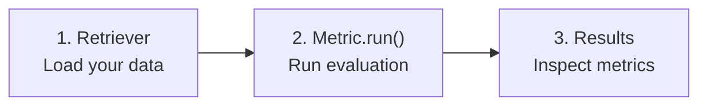

This guide walks you through evaluating an AI assistant's context awareness using the **Context** metric. By the end, you'll understand the three-step pattern that applies to every Gaussia metric.

## Step 1: Define your data retriever

Every evaluation starts with a `Retriever` — a class that loads your conversation data into Gaussia's `Dataset` format.

```python
from gaussia.core.retriever import Retriever
from gaussia.schemas.common import Dataset, Batch


class MyRetriever(Retriever):
    def load_dataset(self) -> list[Dataset]:
        return [
            Dataset(
                session_id="session-001",
                assistant_id="my-assistant",
                language="english",
                context="Gaussia is an AI evaluation framework created by Gaussia Labs.",
                conversation=[
                    Batch(
                        qa_id="q1",
                        query="What is Gaussia?",
                        assistant="Gaussia is an AI evaluation framework.",
                        ground_truth_assistant="Gaussia is an AI evaluation framework created by Gaussia Labs.",
                    ),
                    Batch(
                        qa_id="q2",
                        query="Who created it?",
                        assistant="It was created by Gaussia Labs.",
                        ground_truth_assistant="Gaussia Labs created the framework.",
                    ),
                ],
            )
        ]
```

## Step 2: Run a metric

Every metric follows the same pattern: `Metric.run(RetrieverClass, **config)`.

```python
from langchain_openai import ChatOpenAI
from gaussia.metrics.context import Context

# Use any LangChain-compatible model
model = ChatOpenAI(model="gpt-4o-mini", temperature=0)

# Run the evaluation
results = Context.run(MyRetriever, model=model)
```

## Step 3: Inspect results

Each metric returns a list of result objects with structured data:

```python
for result in results:
    print(f"Session: {result.session_id}")
    print(f"Context awareness: {result.context_awareness:.2f}")
    print(f"Interactions evaluated: {result.n_interactions}")

    for interaction in result.interactions:
        print(f"  {interaction.qa_id}: {interaction.context_awareness:.2f}")
```

```text Output
Session: session-001
Context awareness: 0.92
Interactions evaluated: 2
  q1: 0.90
  q2: 0.95
```

## The pattern

Every Gaussia metric follows this same three-step pattern:



<Tip>
  The `Metric.run()` class method is a convenience shortcut. Under the hood, it instantiates the metric with the retriever, calls `_process()` to iterate through the dataset, and returns the collected metrics.
</Tip>

## Using statistical modes

By default, metrics use `FrequentistMode` (weighted mean). Switch to `BayesianMode` for credible intervals:

```python
from gaussia.statistical import BayesianMode

results = Context.run(
    MyRetriever,
    model=model,
    statistical_mode=BayesianMode(mc_samples=5000, ci_level=0.95),
)

for result in results:
    print(f"Context awareness: {result.context_awareness:.2f}")
    print(f"95% CI: [{result.context_awareness_ci_low:.2f}, {result.context_awareness_ci_high:.2f}]")
```

## Next steps

<CardGroup cols={2}>
  <Card title="Architecture" icon="sitemap" href="concepts/architecture">
    Understand the full evaluation pipeline.
  </Card>
  <Card title="Custom retrievers" icon="database" href="concepts/retriever">
    Connect to your own data sources.
  </Card>
  <Card title="All metrics" icon="chart-bar" href="metrics/context">
    Explore every available metric.
  </Card>
  <Card title="Statistical modes" icon="chart-line" href="concepts/statistical-modes">
    Choose between frequentist and Bayesian analysis.
  </Card>
</CardGroup>
